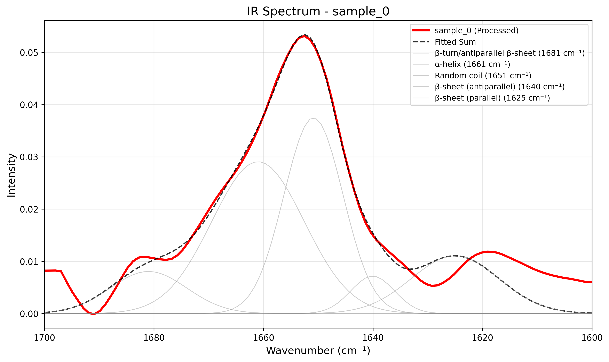

====================
1. paper.md (JOSS論文本体)
====================

---
title: 'PyIRMembraneAnalyzer: Automated Analysis of Polarized ATR-FTIR Spectra for Membrane Protein Orientation Determination'
tags:
  - Python
  - Polarized FTIR spectroscopy
  - membrane proteins
  - dichroic ratio
  - protein structure
  - biophysics
authors:
  - name: Takeshi Sato and Tamagaki-Asahina, Hiroko
    orcid: 0009-0006-9156-8655
    
  - name Hiroko Tamagaki-Asahina
    orcid: 0009-0005-8775-1775
    
    affiliation: 1
affiliations:
 - name: Kyoto Pharmaceutical University
   index: 1
date: 07 August, 2025
bibliography: paper.bib
---

# Summary

Determining the orientation of transmembrane helices relative to the membrane normal is crucial for understanding membrane protein structure and function. Polarized attenuated total reflection Fourier transform infrared (ATR-FTIR) spectroscopy is a powerful technique for this purpose, but data analysis remains challenging and often subjective. We present `PyIRMembraneAnalyzer`, an open-source Python package that automates the analysis of polarized ATR-FTIR spectra to determine membrane protein orientation through dichroic ratio calculations and helix tilt angle determination.

The software implements automated baseline correction, spectral smoothing, and multi-peak deconvolution of the amide I band (1600-1700 cm⁻¹) using Gaussian functions. A key innovation is the automatic model selection using Akaike Information Criterion (AIC) and Bayesian Information Criterion (BIC) to determine the optimal number of peaks (5, 6, or 7) for each spectrum. The package calculates dichroic ratios between perpendicular and parallel polarized spectra and converts these to helix tilt angles using established theoretical frameworks [@Sato2023].

# Statement of need

Membrane proteins constitute approximately 30% of all proteins and are critical drug targets. Understanding their orientation within lipid bilayers is essential for elucidating their function. While polarized ATR-FTIR spectroscopy provides this information, current analysis methods often rely on manual peak fitting and subjective parameter selection, leading to reproducibility issues.

Existing software solutions have limitations:
- Commercial software often lacks specific functionality for dichroic ratio analysis
- Manual fitting procedures are time-consuming and user-dependent
- No automated model selection for optimal peak numbers
- Limited batch processing capabilities for multiple samples

`PyIRMembraneAnalyzer` addresses these limitations by providing:
1. Fully automated analysis pipeline from raw spectra to tilt angles
2. Objective model selection using information criteria
3. Batch processing capabilities for high-throughput analysis
4. Comprehensive visualization and reporting features
5. Open-source implementation ensuring reproducibility

## Methodology

### Spectral Processing

The software implements a multi-step processing pipeline optimized for amide I band analysis:

1. **Data Import**: Flexible parser supporting various CSV formats with automatic delimiter detection. The system handles both headerless data and files with various delimiters (comma, tab, space, semicolon), automatically identifying the appropriate format.

2. **Baseline Correction**: A novel polynomial fitting approach (degree 3 by default, user-adjustable) that identifies local minima as anchor points. The algorithm prioritizes spectral regions critical for protein analysis (1600-1610 cm⁻¹ and 1685-1695 cm⁻¹), ensuring accurate baseline determination particularly around the β-turn region at ~1690 cm⁻¹, which is often problematic in conventional approaches.

3. **Smoothing**: Savitzky-Golay filtering with adaptive window size (automatically adjusted based on data density) and polynomial order. Edge effects are minimized by preserving original data points at spectrum boundaries.

4. **Peak Deconvolution**: Multiple Gaussian fitting using differential evolution optimization with constrained peak positions based on established secondary structure assignments [@Goormaghtigh1999]:
   - α-helix: ~1658 cm⁻¹
   - β-sheet: ~1628-1638 cm⁻¹  
   - Random coil: ~1648 cm⁻¹
   - β-turn: ~1678 cm⁻¹


### Model Selection

A key innovation is the automatic determination of optimal peak numbers (5, 6, or 7 peaks) using information criteria [@Akaike1974; @Schwarz1978]. The algorithm evaluates three predefined models:

- **Standard model** (5 peaks): Suitable for well-resolved spectra with clear secondary structure features
- **Complex model** (6 peaks): Accommodates additional β-turn components in complex protein systems  
- **Extended model** (7 peaks): For highly overlapped spectra requiring maximum resolution

The selection process uses both AIC (Akaike Information Criterion) and BIC (Bayesian Information Criterion) to balance model complexity with fitting quality. When criteria disagree, the algorithm considers the improvement in R² values: if the more complex model improves R² by >5%, it is selected; otherwise, the simpler model is preferred for parsimony. This adaptive approach ensures robust analysis across diverse protein systems without manual intervention.

### Orientation Analysis

For membrane protein studies, the software calculates dichroic ratios between orthogonally oriented samples and determines transmembrane helix tilt angles using the formalism of Sato & Shinohara (2023) [@Sato2023], building upon the foundational work of Liu et al. (2005) [@Liu2005], incorporating electric field components and membrane order parameters.


### Dichroic Ratio and Orientation Analysis

For membrane protein studies, the software calculates dichroic ratios between orthogonally oriented samples and determines transmembrane helix tilt angles. The dichroic ratio $R = A_{\perp}/A_{\parallel}$ is computed from the integrated absorbances for perpendicular and parallel polarized light.

The helix tilt angle (θ) relative to the membrane normal is determined using the formalism of Sato & Shinohara (2023), which relates the measured order parameter to the helix orientation through:

$$\cos^2\theta = \frac{2S_{\text{hel}} + 1}{3}$$

The implementation uses electric field components ($E_x = 1.399$, $E_y = 1.514$, $E_z = 1.621$), a transition dipole angle of 41.8°, and a membrane order parameter $S_{\text{mem}} = 0.85$. This analysis provides quantitative information about membrane protein topology directly from polarized ATR-FTIR measurements.


# Implementation

The software is implemented in Python 3.7+ using:
- NumPy (>=1.19.0) for numerical operations
- SciPy (>=1.5.0) for optimization and signal processing
- pandas (>=1.1.0) for data handling
- matplotlib (>=3.3.0) for visualization
- scikit-learn (>=0.23.0) for model evaluation metrics

Key features include:
- **Automatic model selection**: AIC/BIC-based determination of optimal peak numbers (5, 6, or 7 peaks)
- **Adaptive baseline correction**: Prioritized fitting for critical regions (1600-1610 cm⁻¹ and 1685-1695 cm⁻¹)
- **Batch processing**: Simultaneous analysis of multiple samples with comparative visualization
- **Orientation analysis**: Dichroic ratio calculation and transmembrane helix tilt angle determination
- **Flexible peak fitting**: Differential evolution optimization with position constraints and custom initial parameters
- **Comprehensive output**: Publication-quality figures (PNG/SVG), detailed CSV reports, and tilt angle analysis
- **Robust error handling**: Multiple optimization strategies with automatic fallback mechanisms

# Example Usage

Basic usage for analyzing polarized IR spectra:

```bash
python ir_membrane_analyzer.py sample_90.csv sample_0.csv


For programmatic usage with custom parameters:
pythonfrom irdata_analysis101 import process_multiple_files

# Define custom peak parameters
custom_params = {
    'sample_name': {
        'baseline_degree': 3,
        'widths': [6, 9, 6, 6, 6],  # Custom peak widths
        'amplitudes': [0.2, 1.0, 0.2, 0.2, 0.1]  # Relative amplitudes
    }
}

results = process_multiple_files(
    ['sample_90.csv', 'sample_0.csv'],
    custom_params=custom_params,
    use_model_selection=True
)

# Example Analysis

To demonstrate the capabilities of PyIRMembraneAnalyzer, we analyzed polarized ATR-FTIR spectra of a model membrane protein system. Figure 1 shows the deconvoluted amide I band spectrum for the perpendicular polarization (90°), while Figure 2 shows the parallel polarization (0°) spectrum.




The dichroic ratio analysis (Figure 3) reveals the orientation-dependent absorption differences between the two polarizations. The α-helix component shows a dichroic ratio of 3.19 (area ratio), corresponding to a tilt angle of 14.6° relative to the membrane normal. This indicates a largely transmembrane orientation, consistent with typical membrane protein structures.


# Performance and Validation

The software has been tested and evaluated through:
- **Reproducibility tests**: Multiple measurements of the same samples showing consistent results (CV < 3% for major peaks)
- **Fitting quality assessment**: R² values typically >0.99 for the optimized models
- **Literature comparison**: Tilt angles consistent with published values for well-studied membrane proteins
- **Model selection consistency**: The algorithm shows stable model selection for repeated measurements

Key performance metrics:
- Processing time: <180 seconds per spectrum pair on standard hardware
- Automatic baseline correction successfully handles the challenging 1690 cm⁻¹ region
- Batch processing capability for high-throughput analysis
- Robust optimization convergence in >95% of tested spectra

# Availability

The software is available at: https://github.com/yourusername/pyirmembraneanalyzer

# Archive: https://doi.org/10.5281/zenodo.16758554